# 基于AI技术的高校师德师风教育管理系统

本系统是一个基于 **Spring AI + Vue 3** 的前后端分离项目，主要用于满足新时代教师职业发展需求，提高师德师风教育质量。

## 项目简介

本项目采用前后端分离架构：

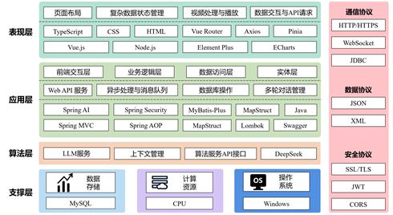

- 后端使用 Spring Boot 提供 RESTful API 接口，Spring AI统一封装DeepSeek API
- 前端使用 Vue 3 构建用户交互界面，Element Plus构建交互组件，提ECharts进行数据可视化展示
- 数据库使用 MySQL 存储业务数据，结合MyBatis完成数据的持久化和查询
- 教师端包含账户管理、学习筑基、能力提升、治理研修和多维评估模块
- 管理端提供教师信息管、师德发展总览和分类统计三大功能

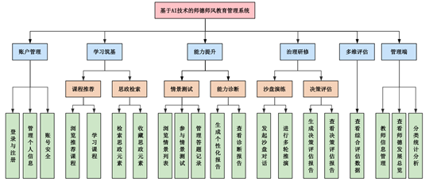

## 技术栈

### 后端技术栈

- Java
- Spring Boot
- Spring AI
- MyBatis
- MySQL
- Maven

### 前端技术栈

- Vue 3
- Vite
- Vue Router
- Pinia
- Axios
- Element Plus
- ECharts

## 项目结构

```text
Teacher_ethics/
├── backend/                 # 后端 Spring AI 项目
│   ├── src/
│   └── pom.xml 
├── course-import/           # 课程数据处理脚本
│   ├── build_courses.py
│   └──csv_to_courses_sql.py
├── front/                   # 前端 Vue 3 项目
│   ├── src/
│   ├── package.json
│   └── vite.config.js
├── .gitignore
├── LICENSE
├── README.md
└──schema.sql                # MySQL 数据库表结构文件
```

## 环境要求

运行项目前，请先准备以下环境：

- JDK 17
- Maven 3.x
- Node.js 20.0
- MySQL 8.0
- Git

具体版本请根据本地项目配置进行调整。

## 数据库准备

本项目使用 MySQL 作为数据存储数据库。schema.sql 仅包含数据库结构定义：

- 数据库创建语句
- 数据表结构
- 字段定义
- 主键、索引、外键约束
- 表之间的关联关系

### 数据库初始化

直接执行：

```bash
mysql -u root -p < schema.sql
```

执行后根据提示输入 MySQL 密码即可。

## 启动后端

进入后端目录：

```bash
cd backend
```

使用 Maven 启动项目：

```bash
mvn spring-boot:run
```

也可以使用 IntelliJ IDEA 打开 `backend` 目录，运行 Spring Boot 启动类。

后端默认访问地址：

```text
http://localhost:8080
```

具体端口以 `application.yml` 中的配置为准。

### 后端配置

后端配置文件位于：

```text
backend/src/main/resources/
```

由于真实配置文件中可能包含数据库账号、密码等敏感信息，请根据示例配置文件创建本地配置文件：

```text
application-example.yaml
```

## 启动前端

进入前端目录：

```bash
cd front
```

安装依赖：

```bash
npm install
```

启动开发服务器：

```bash
npm run dev
```

前端默认访问地址通常为：

```text
http://localhost:5173
```

具体端口以终端输出为准。

### 前后端接口配置

前端通过 Axios 请求后端接口。如果需要修改后端接口地址，请检查/front/vite.config.js中的配置：

```env
server:{
    proxy:{
      '/api':{//获取路径中包含了/api的请求
          target:'http://localhost:8080',//后台服务所在的源
          changeOrigin:true,//修改源
          rewrite:(path)=>path.replace(/^\/api/,'')///api替换为''
      }
    }
  }
```

## 注意事项

1. 第一次运行项目前，请先完成数据库创建和配置文件修改。
2. 后端启动前，请确认 MySQL 服务已经启动。
3. 前端启动前，请先执行 `npm install` 安装依赖。
4. 如果接口请求失败，请检查后端服务是否启动，以及前端接口地址是否配置正确。

## 效果展示


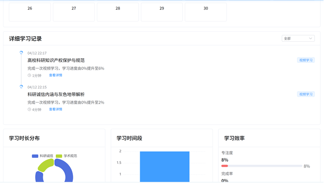

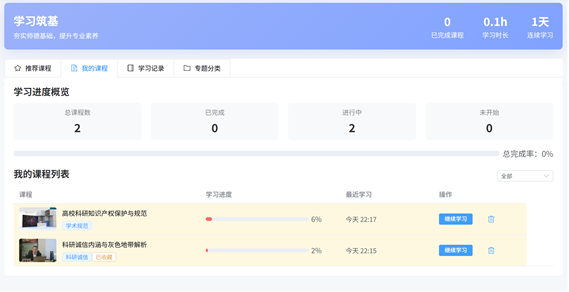


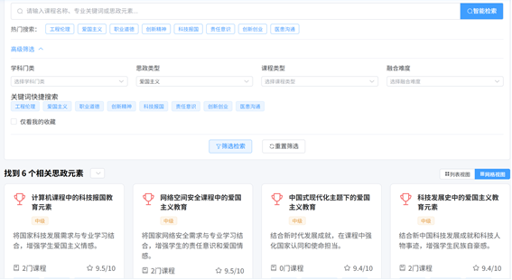


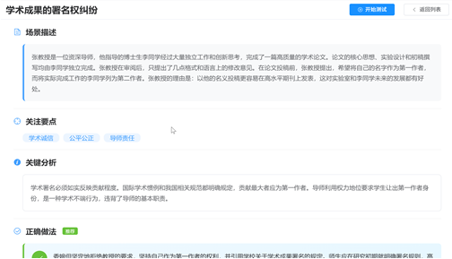

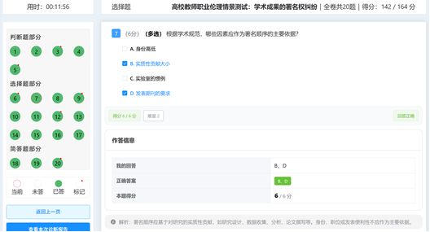

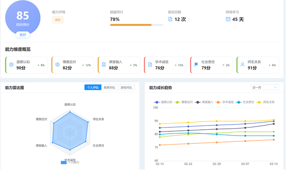

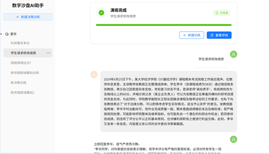

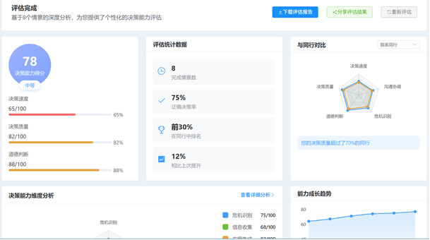

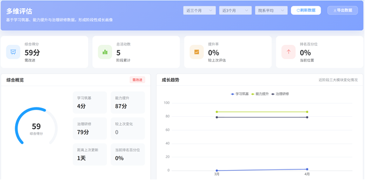

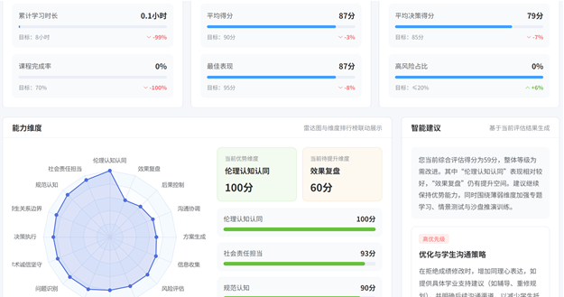

## License

本项目使用 Apache-2.0 license。